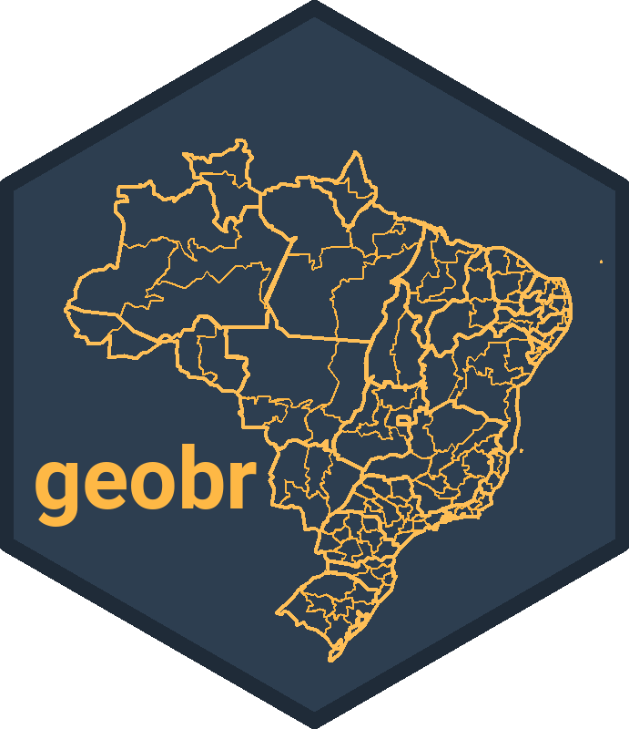
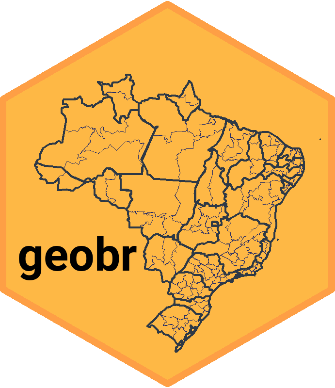

# geobr  

[](https://CRAN.R-project.org/package=geobr)
  [](https://CRAN.R-project.org/package=geobr) 
  [](https://CRAN.R-project.org/package=geobr)
  

[](https://travis-ci.org/ipeaGIT/geobr)
   [](https://codecov.io/gh/ipeaGIT/geobr?branch=master) 


[**geobr**](https://CRAN.R-project.org/package=geobr) is an R package that allows users to easily access official spatial data sets of Brazil. The package includes a wide range of geospatial data as *simple features*, available at various geographic scales and for various years with harmonized attributes, projection and topology (see detailed list below).

## Installation
```R
# From CRAN
  install.packages("geobr")
  library(geobr)

# or use the development version with latest features
  utils::remove.packages('geobr')
  devtools::install_github("ipeaGIT/geobr")
  library(geobr)
```
obs. If you use **Linux**, you need to install a couple dependencies before installing the libraries `sf` and `geobr`. [More info here](https://github.com/r-spatial/sf#linux).


## Basic Usage

The syntax of all `geobr` functions operate one the same logic so it becomes intuitive to download any data set using a single line of code. Like this:

```R
# Read specific municipality at a given year
mun <- read_municipality(code_muni=1200179, year=2017)

# Read all municipalities of given state at a given year
mun <- read_municipality(code_muni=33, year=2010) # or
mun <- read_municipality(code_muni="RJ", year=2010)

# Read all municipalities in the country at a given year
mun <- read_municipality(code_muni="all", year=2018)
```
More examples [here](https://gist.github.com/rafapereirabr/99c9a2d2aecae87219c459965c75b155) and in the [intro Vignette](https://cran.r-project.org/web/packages/geobr/vignettes/intro_to_geobr.html)


## Available datasets:


|Function|Geographies available|Years available|Source|
|-----|-----|-----|-----|
|`read_country`| Country | 1872, 1900, 1911, 1920, 1933, 1940, 1950, 1960, 1970, 1980, 1991, 2000, 2001, 2010, 2013, 2014, 2015, 2016, 2017, 2018 | IBGE |
|`read_region`| Region | 2000, 2001, 2010, 2013, 2014, 2015, 2016, 2017, 2018 | IBGE |
|`read_state`| States | 1872, 1900, 1911, 1920, 1933, 1940, 1950, 1960, 1970, 1980, 1991, 2000, 2001, 2010, 2013, 2014, 2015, 2016, 2017, 2018 | IBGE |
|`read_meso_region`| Meso region | 2000, 2001, 2010, 2013, 2014, 2015, 2016, 2017, 2018 |  IBGE |
|`read_micro_region`| Micro region | 2000, 2001, 2010, 2013, 2014, 2015, 2016, 2017, 2018 | IBGE |
|`read_intermediate_region`| Intermediate region | 2017 |  IBGE |
|`read_immediate_region`| Immediate region | 2017 |  IBGE |
|`read_municipality`| Municipality | 1872, 1900, 1911, 1920, 1933, 1940, 1950, 1960, 1970, 1980, 1991, 2000, 2001, 2005, 2007, 2010, 2013, 2014, 2015, 2016, 2017, 2018 |IBGE |
|`read_weighting_area`| Census weighting area (área de ponderação) |  2010 | IBGE |
|`read_census_tract`| Census tract (setor censitário) |  2000, 2010 | IBGE |
|`read_statistical_grid` | Statistical Grid of 200 x 200 meters | 2010 | IBGE |
|`read_health_facilities` | Health facilities | 2015 | CNES, DataSUS | 
|`read_indigenous_land` | Indigenous lands | 201907 | FUNAI | 
|`read_biomes` | Biomes | 2004, 2019 | IBGE | 
|`read_disaster_risk_area` | Disaster risk areas | 2010 | CEMADEN and IBGE | 
|`read_amazon` | Brazil's Legal Amazon | 2012 | MMA | 
|`read_conservation_units` | Environmental Conservation Units | 201909 | MMA | 
|`read_urban_area` | Urban footprints | 2005, 2015 | IBGE | 
|`read_semiarid` | Semi Arid region | 2005, 2017 | IBGE | 
|`read_metro_area` (dev) | Metropolitan areas | 1970, 2001, 2002, 2003, 2005, 2010, 2013, 2014, 2015, 2016, 2017, 2018 | IBGE | 


### Other functions:


| Function | Action|
|-----|-----|
|`grid_state_correspondence_table`| Loads a correspondence table indicating what quadrants of IBGE's statistical grid intersect with each state |
|`lookup_muni` (dev)| Look up municipality codes by their name, or the other way around |
| ... | ... | ... | 


Note 1. Data sets and Functions marked with "dev" are only available in the development version of `geobr`.

Note 2. All datasets use geodetic reference system "SIRGAS2000", CRS(4674). Most data sets are available at scale 1:250,000 (see documentation for details).
 
## Coming soon:

| Geography | Years available | Source |
|-----|-----|-----|
|`read_census_tract` | 2007 | IBGE |
| Longitudinal Database* of municipalities | ... | IBGE | 
| Longitudinal Database* of micro regions | ... | IBGE | 
| Longitudinal Database* of Census tracts | ... | IBGE | 
| Schools | 2019 | School Census (Inep) | 
| ... | ... | ... | 
| ... | ... | ... | 

'*' Longitudinal Database refers to áreas mínimas comparáveis (AMCs)

* [Quadro geográfico de referência para produção, análise e disseminação de estatísticas](https://www.ibge.gov.br/geociencias/organizacao-do-territorio/analises-do-territorio/24233-quadro-geografico-de-referencia-para-producao-analise-e-disseminacao-de-estatisticas.html?=&t=o-que-e)
* [Regiões Metropolitanas, Aglomerações Urbanas e Regiões Integradas de Desenvolvimento](https://www.ibge.gov.br/geociencias/organizacao-do-territorio/estrutura-territorial/18354-regioes-metropolitanas-aglomeracoes-urbanas-e-regioes-integradas-de-desenvolvimento.html?=&t=acesso-ao-produto)
* Outros arquivos e recortes estão disponiveis em [ftp://geoftp.ibge.gov.br/](ftp://geoftp.ibge.gov.br/).


## Credits 

The shapefiles are created by IBGE. The **geobr** package is developed by a team at the Institute for Applied Economic Research (Ipea), Brazil. If you want to cite this package, you can cite it as:

* Pereira, R.H.M.; Gonçalves, C.N.; Araujo, P.H.F. de; Carvalho, G.D.; Nascimento, I.; Arruda, R.A. de. (2019) **geobr: an R package to easily access shapefiles of the Brazilian Institute of Geography and Statistics**. GitHub repository - https://github.com/ipeaGIT/geobr.


### Advantages of **geobr** and related projects
As of today, there are two other R packges with similar functionalities. These are the packages [simplefeaturesbr](https://github.com/RobertMyles/simplefeaturesbr) and [brazilmaps](https://CRAN.R-project.org/package=brazilmaps). The **geobr** package follows an intuitive syntax and it has a few advantages when compared to other packages, including for example:
- Access to a wider range of official spatial data sets, such as states and municipalities, but also macro-, meso- and micro-regions, weighting areas, census tracts, urbanized areas, etc
- Access to shapefiles with updated geometries for various years
- Harmonized attributes and geographic projections across geographies and years


