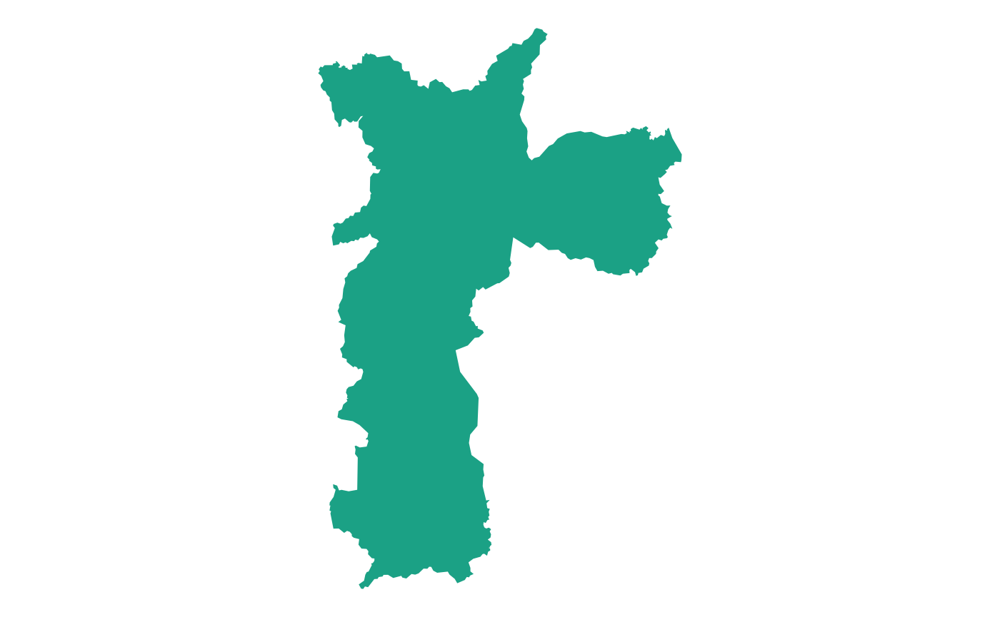
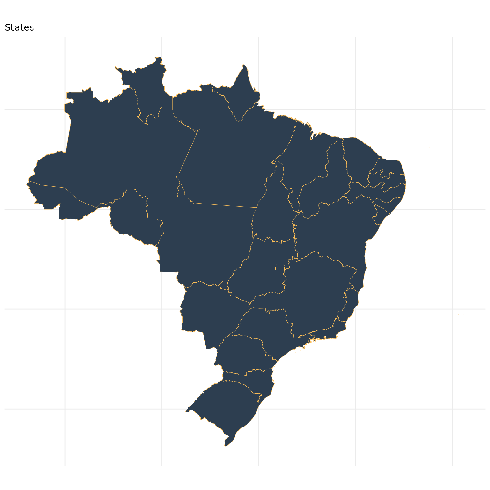
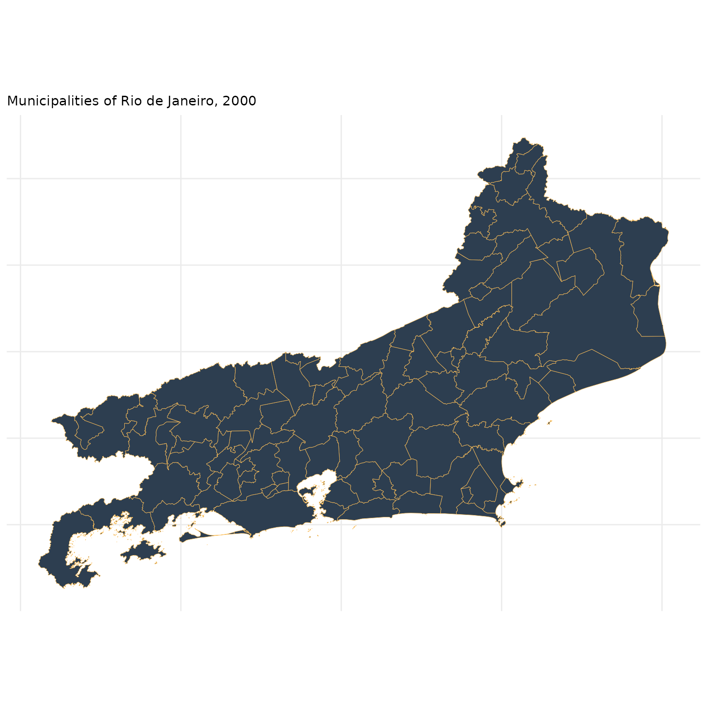
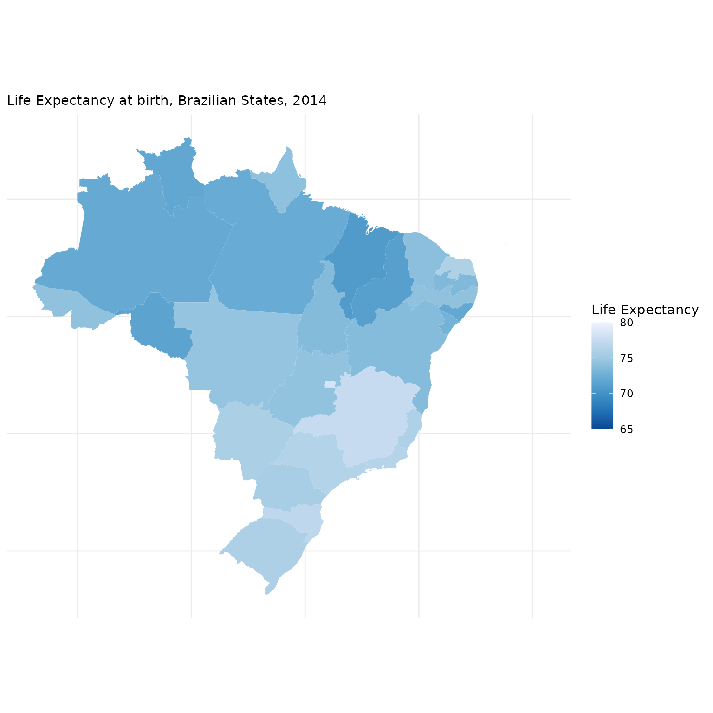
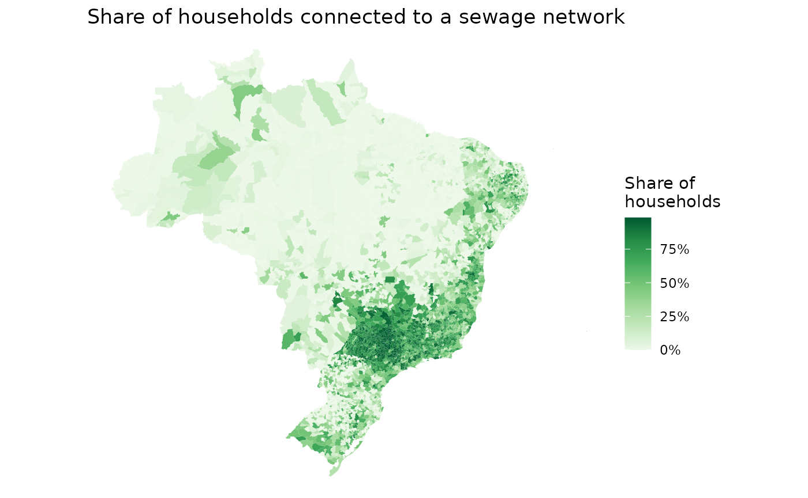

# Introductio to geobr (R)

The [**geobr**](https://github.com/ipeaGIT/geobr) package provides quick
and easy access to official spatial data sets of Brazil. The syntax of
all **geobr** functions operate on a simple logic that allows users to
easily download a wide variety of data sets with updated geometries and
harmonized attributes and geographic projections across geographies and
years. This vignette presents a quick intro to **geobr**.

### Installation

You can install geobr from CRAN or the development version to use the
latest features.

``` r

# From CRAN
install.packages("geobr")

# Development version
utils::remove.packages('geobr')
devtools::install_github("ipeaGIT/geobr", subdir = "r-package")
```

Now let’s load the libraries we’ll use in this vignette.

``` r

library(geobr)
library(sf)
library(dplyr)
library(ggplot2)
```

### General usage

#### Available data sets

The geobr package currently covers 30 spatial data sets, including a
variety of political-administrative and statistical areas used in
Brazil. You can view what data sets are available using the
[`list_geobr()`](https://ipeagit.github.io/geobr/dev/reference/list_geobr.md)
function.

``` r

# Available data sets
datasets <- list_geobr(wide = TRUE)

head(datasets)
#>                  Function                        geography           source
#> 1             read_amazon            Brazil's Legal Amazon              MMA
#> 2             read_biomes                           Biomes             IBGE
#> 3       read_census_tract  Census tract (setor censitário)             IBGE
#> 4 read_conservation_units Environmental Conservation Units              MMA
#> 5            read_country                          Country             IBGE
#> 6 read_disaster_risk_area              Disaster risk areas CEMADEN and IBGE
#>                                                                                                                                                               year
#> 1                                                                                                                                     2019, 2020, 2021, 2022, 2024
#> 2                                                                                                                                                 2006, 2019, 2025
#> 3                                                                                                                                                 2000, 2010, 2022
#> 4                                                                                                                                                   202402, 202503
#> 5 1872, 1900, 1911, 1920, 1933, 1940, 1950, 1960, 1970, 1980, 1991, 2000, 2001, 2010, 2013, 2014, 2015, 2016, 2017, 2018, 2019, 2020, 2021, 2022, 2023, 2024, 2025
#> 6                                                                                                                                                             2010
```

### Download spatial data as `sf` objects

The syntax of all *geobr* functions operate one the same logic, so the
code to download the data becomes intuitive for the user. Here are a few
examples.

Download an specific geographic area at a given year:

``` r

# State of Sergige
state <- read_state(
  year = 2022,
  code_state = "SE",
  showProgress = FALSE
  )

# Municipality of Sao Paulo
muni <- read_municipality(
  year = 2022, 
  code_muni = 3550308, 
  showProgress = FALSE
  )

ggplot() + 
  geom_sf(data = muni, color=NA, fill = '#1ba185') +
  theme_void()
```



Download all geographic areas within a state at a given year:

``` r

# All municipalities in the state of Minas Gerais
muni <- read_municipality(
  year = 2022,
  code_muni = "MG", 
  showProgress = FALSE
  )

head(muni)
```

If the parameter `code_` is not passed to the function, geobr returns
the data for the whole country by default.

``` r

# read all schools
inter <- read_schools(
  year = 2022,
  showProgress = FALSE
  )

# read all states
states <- read_state(
  year = 2025, 
  showProgress = FALSE
  )

head(states)
#> Simple feature collection with 6 features and 6 fields
#> Geometry type: GEOMETRY
#> Dimension:     XY
#> Bounding box:  xmin: -73.98681 ymin: -13.6937 xmax: -46.06151 ymax: 5.26962
#> Geodetic CRS:  SIRGAS 2000
#>   code_state name_state abbrev_state code_region name_region year
#> 1         11   Rondônia           RO           1       Norte 2025
#> 2         12       Acre           AC           1       Norte 2025
#> 3         13   Amazonas           AM           1       Norte 2025
#> 4         14    Roraima           RR           1       Norte 2025
#> 5         15       Pará           PA           1       Norte 2025
#> 6         16      Amapá           AP           1       Norte 2025
#>                         geometry
#> 1 POLYGON ((-60.77415 -13.661...
#> 2 POLYGON ((-68.444 -11.04576...
#> 3 POLYGON ((-67.32582 -9.5923...
#> 4 POLYGON ((-61.46517 -0.6601...
#> 5 MULTIPOLYGON (((-50.10534 -...
#> 6 MULTIPOLYGON (((-49.89785 1...
```

### Important note about data resolution

All functions to download polygon data such as states, municipalities
etc. have a `simplified` argument. When `simplified = FALSE`, geobr
returns the original data set with high resolution at detailed
geographic scale (see documentation). By default, however,
`simplified = TRUE` and geobr returns data geometries with simplified
borders to improve speed of downloading and plotting the data.

### Plot the data

Once you’ve downloaded the data, it is really simple to plot maps using
`ggplot2`.

``` r

# Remove plot axis
no_axis <- theme(axis.title=element_blank(),
                 axis.text=element_blank(),
                 axis.ticks=element_blank())

# Plot all Brazilian states
ggplot() +
  geom_sf(data=states, fill="#2D3E50", color="#FEBF57", size=.15, show.legend = FALSE) +
  labs(subtitle="States", size=8) +
  theme_minimal() +
  no_axis
```



Plot all the municipalities of a particular state, such as Rio de
Janeiro:

``` r


# Download all municipalities of Rio
all_muni <- read_municipality(
  year= 2022,
  code_muni = "RJ", 
  showProgress = FALSE
  )

# plot
ggplot() +
  geom_sf(data=all_muni, fill="#2D3E50", color="#FEBF57", size=.15, show.legend = FALSE) +
  labs(subtitle="Municipalities of Rio de Janeiro, 2000", size=8) +
  theme_minimal() +
  no_axis
```



### Thematic maps

The next step is to combine data from **geobr** package with other data
sets to create thematic maps. In this first example, we will be using
data from the (Atlas of Human Development (by Ipea/FJP and UNPD) to
create a choropleth map showing the spatial variation of **Life
Expectancy at birth** across Brazilian states.

##### Merge external data

First, we need a `data.frame` with estimates of Life Expectancy. We then
need to merge this table to our spatial database. The two-digit
abbreviation of state name is our key column to join these two data
sets.

``` r

# Read data.frame with life expectancy data
df <- data.table::fread(
  system.file("extdata/br_states_lifexpect2017.csv", package = "geobr")
  )

# join the databases
states <- dplyr::left_join(
  x = states, 
  y = df, 
  by = c("name_state" = "uf")
  )
```

##### Plot thematic map

``` r

ggplot() +
  geom_sf(data=states, aes(fill=ESPVIDA2017), color= NA, size=.15) +
    labs(subtitle="Life Expectancy at birth, Brazilian States, 2014", size=8) +
    scale_fill_distiller(palette = "Blues", name="Life Expectancy", limits = c(65,80)) +
    theme_minimal() +
    no_axis
```



## Using **geobr** together with **censobr**

Following the same steps as above, we can use together **geobr** with
our sister package
[**censobr**](https://ipeagit.github.io/censobr/index.html) to map the
proportion of households connected to a sewage network in Brazilian
municipalities

First, we need to download households data from the Brazilian census
using the
[`read_households()`](https://ipeagit.github.io/censobr/reference/read_households.html)
function.

``` r

library(censobr)
library(arrow)
#> 
#> Attaching package: 'arrow'
#> The following object is masked from 'package:utils':
#> 
#>     timestamp

hs <- read_households(
  year = 2010, 
  showProgress = FALSE
  )
#> ℹ Downloading data and storing it locally for future use.
```

Now we’re going to (a) group observations by municipality, (b) get the
number of households connected to a sewage network, (c) calculate the
proportion of households connected, and (d) collect the results.

``` r

esg <- hs |> 
        collect() |>
        group_by(code_muni) |>                                             # (a)
        summarize(rede = sum(V0010[which(V0207=='1')]),                    # (b)
                  total = sum(V0010)) |>                                   # (b)
        mutate(cobertura = rede / total) |>                                # (c)
        collect()                                                          # (d)

head(esg)
#> # A tibble: 6 × 4
#>   code_muni     rede  total cobertura
#>       <int>    <dbl>  <dbl>     <dbl>
#> 1   1100015     0     7443.   0      
#> 2   1100023   182.   27654.   0.00660
#> 3   1100031     0     1979.   0      
#> 4   1100049 10019.   24413.   0.410  
#> 5   1100056     5.81  5399    0.00108
#> 6   1100064    28.9   6013.   0.00480
```

Now we only need to download the geometries of Brazilian municipalities
from **geobr**, merge the spatial data with our estimates and map the
results.

``` r

# download municipality geometries
muni_sf <- geobr::read_municipality(
  year = 2010,
  showProgress = FALSE
  )
#> ℹ Using year/date 2010

# merge data
esg_sf <- left_join(muni_sf, esg, by = 'code_muni')

# plot map
ggplot() +
  geom_sf(data = esg_sf, aes(fill = cobertura), color=NA) +
  labs(title = "Share of households connected to a sewage network") +
  scale_fill_distiller(palette = "Greens", direction = 1, 
                       name='Share of\nhouseholds', 
                       labels = scales::percent) +
  theme_void()
```


