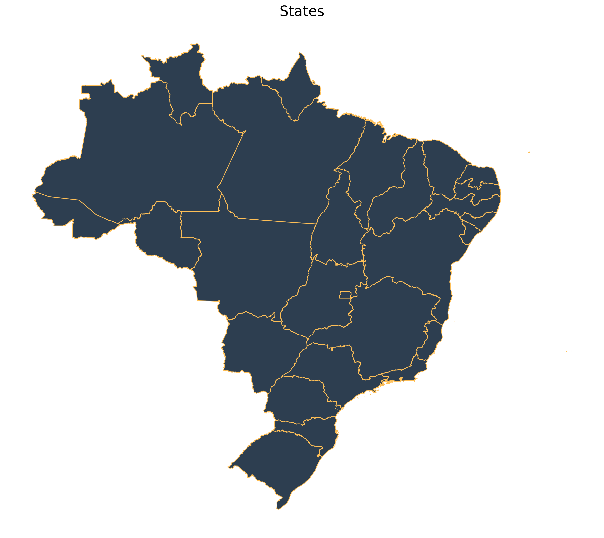
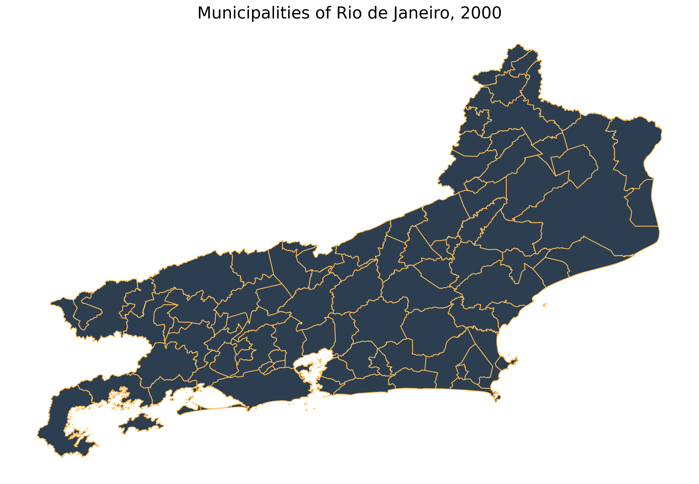
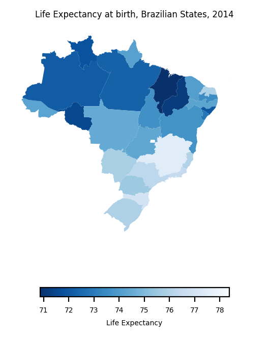

The [**geobr**](https://github.com/ipea/geobr) package provides quick and 
easy access to official spatial data sets of Brazil. The package offers a wide 
range of spatial data sets available at various geographic scales and for various 
years with harmonized attributes, projection and fixed topology. All **geobr** 
functions follow a simple and consistent syntax that allows users to seamlessly 
download data and work with it either in memory using GeoPandas or out of memory using 
DuckDB and Arrow. This vignette presents a quick intro to **geobr**.

## Installation

You can install geobr from PyPI:

`pip install geobr`

Now let's load the libraries we'll use in this vignette.


```python
import geobr
import matplotlib.pyplot as plt
import pandas as pd

%matplotlib inline
```

## General usage

### Available data sets

The geobr package currently covers 30 spatial data sets, including a variety of 
political-administrative and statistical areas used in Brazil. You can view what 
data sets are available using the `list_geobr()` function.


```python
# Available data sets and years
geobr.list_geobr().head()
```

|    | Function          | geography    | source   | alias        | years_available      |
|---:|:------------------|:-------------|:---------|:-------------|:-----------------------------------------------------------------------------------------------------------------------------------------------------------------|
|  0 | read_country      | Country      | IBGE     | country      | 1872, 1900, 1911, 1920, 1933, 1940, 1950, 1960, 1970, 1980, 1991, 2000, 2001, 2010, 2013, 2014, 2015, 2016, 2017, 2018, 2019, 2020, 2021, 2022, 2023, 2024, 2025 |
|  1 | read_region       | Region       | IBGE     | regions      | 1872, 1900, 1911, 1920, 1933, 1940, 1950, 1960, 1970, 1980, 1991, 2000, 2001, 2010, 2013, 2014, 2015, 2016, 2017, 2018, 2019, 2020, 2021, 2022, 2023, 2024, 2025 |
|  2 | read_state        | States       | IBGE     | states       | 1872, 1900, 1911, 1920, 1933, 1940, 1950, 1960, 1970, 1980, 1991, 2000, 2001, 2010, 2013, 2014, 2015, 2016, 2017, 2018, 2019, 2020, 2021, 2022, 2023, 2024, 2025 |
|  3 | read_meso_region  | Meso region  | IBGE     | mesoregions  | 2000, 2001, 2013, 2014, 2015, 2016, 2017, 2018, 2019, 2020, 2021, 2022                                                                                           |
|  4 | read_micro_region | Micro region | IBGE     | microregions | 2000, 2001, 2013, 2014, 2015, 2016, 2017, 2018, 2019, 2020, 2021, 2022                                                                                           |

## Download spatial data as `GeoDataFrames`

The syntax of all *geobr* functions operate on the same logic, so the code to download the data becomes intuitive for the user. Here are a few examples.

Download a specific geographic area at a given year


```python
# State of Sergige
state = geobr.read_state(code_state="SE", year=2018)
# Municipality of Sao Paulo
muni = geobr.read_municipality(code_muni=3550308, year=2010)
```

Download all geographic areas within a state at a given year


```python
# All municipalities in the state of Alagoas
muni = geobr.read_municipality(code_muni="AL", year=2007)

# All census tracts in the state of Rio de Janeiro
cntr = geobr.read_census_tract(code_tract="RJ", year=2010)
```

If the parameter `code_` is not passed to the function, geobr returns the data for the whole country by default.


```python
states = geobr.read_state(year=2019)
```

## Important note about data resolution

All functions to download polygon data such as states, municipalities etc. have a `simplified` argument. When `simplified=False`, geobr will return the original data set with high resolution at detailed geographic scale (see documentation). By default, however, `simplified=True` and geobr returns data set geometries with simplified borders to improve speed of downloading and plotting the data.

## Plot the data


Once you've downloaded the data, it is really simple to plot maps using `matplotlib`.


```python
# Plot all Brazilian states
fig, ax = plt.subplots(figsize=(15, 15), dpi=300)

states.plot(facecolor="#2D3E50", edgecolor="#FEBF57", ax=ax)

ax.set_title("States", fontsize=20)
ax.axis("off")
```


    (-76.24758052685, -26.590708254149995, -35.70232894755864, 7.22299203073151)


    

    


Plot all the municipalities of a particular state, such as Rio de Janeiro:


```python
# Download all municipalities of Rio
all_muni = geobr.read_municipality(code_muni="RJ", year=2010)
```


```python
# plot
fig, ax = plt.subplots(figsize=(15, 15), dpi=300)

all_muni.plot(facecolor="#2D3E50", edgecolor="#FEBF57", ax=ax)

ax.set_title("Municipalities of Rio de Janeiro, 2000", fontsize=20)
ax.axis("off")
```


    (-45.08586065211478,
     -40.7619784166046,
     -23.499218287945578,
     -20.632919136978526)


    

    

## Lazy evaluation with DuckDB and Arrow

By default, all functions in geobr use `output = "gpd"` and return a GeoPandas' `geodataframe` object 
loaded into memory. In some cases, however, it may be preferable to process data 
out of memory for faster and more memory-efficient computation, particularly when 
working with large spatial data sets.

To support these workflows, users can set `output = "duckdb"` to return a lazy
`DuckDBPyRelation` object. It uses the official DuckDB Spatial extansion to enable a "GEOMETRY" data type.
This allows data to be analyzed with DuckDB, enabling efficient out-of-memory spatial operations. Users can also leverage a DuckDB power-user API with auto-resolving `query()`, as shown in this [example](..\..\..\python-package\examples\duckdb_demo.ipynb).


Alternatively, users can set `output = "arrow"` to return an Arrow dataset, which 
can be integrated with the Arrow ecosystem for scalable analytical workflows. 
Note that PyArrow lacks a special geometry data type and does not natively process 
geographic coordinates without extra tools. Geobr returns the `geometry` column stored 
as Well-Known Binary (WKB) byte arrays and the user can use the GeoArrow library for optimized
spatial operations.
 

```python
# return duckdb DuckDBPyRelation
muni_duck = geobr.read_municipality(year = 2022, output = "duckdb")

# return arrow table
muni_arrow = geobr.read_municipality(year = 2022, output = "arrow")

```


## Thematic maps

The next step is to combine  data from ***geobr*** package with other data sets to create thematic maps. In this example, we will be using data from the (Atlas of Human Development [(a project of our colleagues at Ipea)](https://atlasbrasil.org.br/) to create a choropleth map showing the spatial variation of Life Expectancy at birth across Brazilian states.

#### Merge external data

First, we need a `DataFrame` with estimates of Life Expectancy and merge it to our spatial database. The two-digit abbreviation of state name is our key column to join these two databases.


```python
# Read DataFrame with life expectancy data
data_url = "https://raw.githubusercontent.com/ipea/geobr/master/r-package/inst/extdata/br_states_lifexpect2017.csv"

df = pd.read_csv(data_url, index_col=0)

states["name_state"] = states["name_state"].str.lower()
df["uf"] = df["uf"].str.lower()

# join the databases
states = states.merge(df, how="left", left_on="name_state", right_on="uf")
```

#### Plot thematic map


```python
plt.rcParams.update({"font.size": 5})

fig, ax = plt.subplots(figsize=(4, 4), dpi=200)

states.plot(
    column="ESPVIDA2017",
    cmap="Blues_r",
    legend=True,
    legend_kwds={
        "label": "Life Expectancy",
        "orientation": "horizontal",
        "shrink": 0.6,
    },
    ax=ax,
)

ax.set_title("Life Expectancy at birth, Brazilian States, 2014")
ax.axis("off")
```


    (-76.24758052684999,
     -26.590708254149995,
     -35.70232894755864,
     7.222992030731511)


    

    

